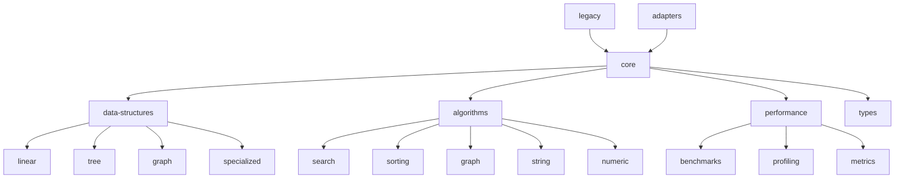

# Algorithmsts Library Complete Package Structure Design

## Executive Summary

This document provides a comprehensive overview of the new package structure design for the Algorithmsts library. It synthesizes all the architectural decisions, interface specifications, design patterns, naming conventions, infrastructure components, and migration strategies into a unified design blueprint.

## Design Philosophy

The new package structure is built on these core principles:

1. **SOLID Principles**: Every component follows Single Responsibility, Open/Closed, Liskov Substitution, Interface Segregation, and Dependency Inversion principles
2. **Modularity**: Clear separation of concerns with well-defined module boundaries
3. **Consistency**: Uniform patterns and conventions across all components
4. **Extensibility**: Easy to add new data structures and algorithms
5. **Performance**: Built-in monitoring and optimization capabilities
6. **Maintainability**: Clear organization and comprehensive documentation

## Architectural Overview

### High-Level Structure

```
algorithmsts/
├── src/
│   ├── core/                    # Core infrastructure and utilities
│   │   ├── interfaces/         # Common interfaces and types
│   │   ├── abstracts/          # Abstract base classes
│   │   ├── utils/              # Utility functions and helpers
│   │   ├── validation/         # Input validation and error handling
│   │   └── index.ts            # Core module exports
│   ├── data-structures/        # Data structure implementations
│   │   ├── linear/             # Linear structures (lists, stacks, queues)
│   │   ├── tree/               # Tree structures (binary trees, tries)
│   │   ├── graph/              # Graph structures and representations
│   │   └── specialized/        # Specialized structures (skip lists, segment trees)
│   ├── algorithms/             # Algorithm implementations
│   │   ├── search/             # Search algorithms (binary search, etc.)
│   │   ├── sorting/            # Sorting algorithms
│   │   ├── graph/              # Graph algorithms
│   │   ├── string/             # String algorithms
│   │   └── numeric/            # Numerical algorithms
│   ├── performance/            # Performance monitoring and benchmarking
│   │   ├── benchmarks/         # Benchmark implementations
│   │   ├── profiling/          # Profiling utilities
│   │   └── metrics/            # Performance metrics collection
│   ├── types/                  # Global type definitions
│   ├── legacy/                 # Backward compatibility layer
│   ├── adapters/               # Adapter implementations
│   └── index.ts               # Main library entry point
├── test/                      # Test suites
├── docs/                      # Documentation
└── tools/                     # Build and development tools
```

### Module Dependencies



## Core Components

### Interface Hierarchy

The interface hierarchy establishes contracts for all library components:

1. **Base Interfaces**:
   - `ICollection<T>`: Base collection interface
   - `IAddableCollection<T>`: Collections that support addition
   - `IRemovableCollection<T>`: Collections that support removal
   - `ILookupCollection<T>`: Collections that support lookup

2. **Data Structure Interfaces**:
   - `IDataStructure<T>`: Base data structure interface
   - `IOrderedDataStructure<T>`: Ordered data structures
   - `IIndexedDataStructure<T>`: Indexed data structures
   - `IList<T>`: List-specific interface
   - `IStack<T>`: Stack interface
   - `IQueue<T>`: Queue interface

3. **Tree Interfaces**:
   - `ITreeNode<T>`: Base tree node interface
   - `ITree<T>`: Base tree interface
   - `IBinaryTreeNode<T>`: Binary tree node interface
   - `IBinarySearchTree<T>`: Binary search tree interface

4. **Graph Interfaces**:
   - `IGraph<T, W>`: Base graph interface
   - `IWeightedGraph<T, W>`: Weighted graph interface

5. **Algorithm Interfaces**:
   - `IAlgorithm<TInput, TOutput>`: Base algorithm interface
   - `ISearchAlgorithm<T>`: Search algorithm interface
   - `ISortingAlgorithm<T>`: Sorting algorithm interface
   - `IGraphAlgorithm<T, R, W>`: Graph algorithm interface

### Abstract Base Classes

Abstract classes provide common functionality and enforce patterns:

1. **BaseCollection<T>**: Common collection functionality
2. **BaseDataStructure<T>**: Common data structure functionality
3. **BaseAlgorithm<TInput, TOutput>`: Common algorithm functionality
4. **BaseTree<T>`: Common tree functionality

### Utility Components

Utilities provide common functionality across modules:

1. **ComparisonUtils**: Comparison operations and functions
2. **ValidationUtils**: Input validation functions
3. **ConversionUtils**: Type conversion utilities
4. **PerformanceMonitor**: Performance monitoring and metrics

### Validation System

Comprehensive validation and error handling:

1. **Validator Class**: Static validation methods
2. **Custom Error Classes**: Specific error types
3. **Error Handling Patterns**: Consistent error management

## Design Patterns Implementation

### Pattern Usage Matrix

| Pattern | Usage | Examples |
|----------|------|----------|
| Abstract Factory | Creating families of related objects | DataStructureFactory, AlgorithmFactory |
| Strategy | Interchangeable algorithms | SortingStrategy, SearchStrategy |
| Template Method | Algorithm skeleton | BaseAlgorithm.execute() |
| Observer | Event notification | ProgressObserver, DataStructureObserver |
| Builder | Complex object construction | LinkedListBuilder, BinarySearchTreeBuilder |
| Adapter | Interface compatibility | LegacyListAdapter |
| Decorator | Dynamic functionality | LoggingDecorator, CachingDecorator |
| Command | Operation encapsulation | AddCommand, RemoveCommand |

### Pattern Relationships


## Data Structure Organization

### Linear Data Structures

```
data-structures/linear/
├── list/
│   ├── linked-list/
│   │   ├── interfaces.ts
│   │   ├── linked-list.ts
│   │   └── index.ts
│   ├── array-list/
│   └── index.ts
├── stack/
│   ├── array-stack/
│   ├── linked-stack/
│   └── index.ts
└── queue/
    ├── array-queue/
    ├── linked-queue/
    └── index.ts
```

### Tree Data Structures

```
data-structures/tree/
├── binary-tree/
│   ├── binary-search-tree/
│   ├── avl-tree/
│   └── index.ts
├── trie/
│   ├── interfaces.ts
│   ├── trie.ts
│   └── index.ts
├── segment-tree/
│   ├── interfaces.ts
│   ├── segment-tree.ts
│   └── index.ts
└── suffix-tree/
    ├── interfaces.ts
    ├── suffix-tree.ts
    └── index.ts
```

### Graph Data Structures

```
data-structures/graph/
├── adjacency-list/
│   ├── interfaces.ts
│   ├── adjacency-list.ts
│   └── index.ts
├── adjacency-matrix/
│   ├── interfaces.ts
│   ├── adjacency-matrix.ts
│   └── index.ts
└── index.ts
```

### Specialized Data Structures

```
data-structures/specialized/
├── skip-list/
│   ├── interfaces.ts
│   ├── skip-list.ts
│   └── index.ts
├── sparse-table/
│   ├── interfaces.ts
│   ├── sparse-table.ts
│   └── index.ts
└── index.ts
```

## Algorithm Organization

### Search Algorithms

```
algorithms/search/
├── binary-search/
│   ├── interfaces.ts
│   ├── binary-search.ts
│   └── index.ts
├── linear-search/
├── interpolation-search/
└── index.ts
```

### Sorting Algorithms

```
algorithms/sorting/
├── comparison-sort/
│   ├── bubble-sort.ts
│   ├── insertion-sort.ts
│   ├── selection-sort.ts
│   └── index.ts
├── merge-sort/
├── quick-sort/
├── heap-sort/
├── counting-sort/
├── radix-sort/
└── index.ts
```

### Graph Algorithms

```
algorithms/graph/
├── traversal/
│   ├── bfs.ts
│   ├── dfs.ts
│   └── index.ts
├── shortest-path/
│   ├── dijkstra.ts
│   ├── floyd-warshall.ts
│   └── index.ts
├── spanning-tree/
│   ├── kruskal.ts
│   ├── prim.ts
│   └── index.ts
└── index.ts
```

## Performance Infrastructure

### Benchmarking System

```
performance/benchmarks/
├── data-structures/
│   ├── list-benchmarks.ts
│   ├── tree-benchmarks.ts
│   └── graph-benchmarks.ts
├── algorithms/
│   ├── sorting-benchmarks.ts
│   ├── search-benchmarks.ts
│   └── graph-benchmarks.ts
└── index.ts
```

### Profiling System

```
performance/profiling/
├── profiler.ts
├── memory-profiler.ts
├── time-profiler.ts
└── index.ts
```

### Metrics Collection

```
performance/metrics/
├── collector.ts
├── analyzer.ts
├── reporter.ts
└── index.ts
```

## Naming Conventions Summary

### File and Directory Naming

- **Directories**: kebab-case (e.g., `data-structures`, `binary-search`)
- **Files**: kebab-case (e.g., `linked-list.ts`, `comparison-utils.ts`)
- **Interface Files**: `interfaces.ts` for module-specific interfaces
- **Index Files**: `index.ts` for module exports
- **Test Files**: `.test.ts` suffix (e.g., `linked-list.test.ts`)

### Code Element Naming

- **Interfaces**: PascalCase with 'I' prefix (e.g., `ICollection`, `IComparable`)
- **Classes**: PascalCase (e.g., `LinkedList`, `BinarySearchTree`)
- **Functions**: camelCase (e.g., `binarySearch`, `mergeSort`)
- **Constants**: UPPER_SNAKE_CASE (e.g., `DEFAULT_COMPARATOR`, `MAX_LEVEL`)
- **Types**: PascalCase (e.g., `ComparisonFunction`, `Complexity`)

## Migration Path

### Current to New Structure Mapping

| Current Location | New Location | Migration Priority |
|-----------------|---------------|-------------------|
| `src/binarySearch/` | `src/algorithms/search/binary-search/` | High |
| `src/linkedList/` | `src/data-structures/linear/list/linked-list/` | High |
| `src/skipList/` | `src/data-structures/specialized/skip-list/` | High |
| `src/segmentTree/` | `src/data-structures/specialized/segment-tree/` | High |
| `src/trie/` | `src/data-structures/tree/trie/` | Medium |
| `src/suffixTree/` | `src/data-structures/tree/suffix-tree/` | Medium |
| `src/sorting/` | `src/algorithms/sorting/` | Medium |
| `src/graphs/` | `src/data-structures/graph/` + `src/algorithms/graph/` | Medium |
| `src/strings/` | `src/algorithms/string/` | Low |

### Backward Compatibility Strategy

1. **Legacy Exports**: Maintain old export paths with deprecation warnings
2. **Adapter Classes**: Create adapters for old interfaces
3. **Migration Guide**: Provide clear documentation for migrating to new APIs
4. **Version Support**: Support both old and new APIs during transition period

## Implementation Guidelines

### SOLID Principles Implementation

1. **Single Responsibility**: Each class has one reason to change
2. **Open/Closed**: Open for extension, closed for modification
3. **Liskov Substitution**: Implementations can substitute without breaking
4. **Interface Segregation**: Focused, minimal interfaces
5. **Dependency Inversion**: Depend on abstractions, not concretions

### Code Quality Standards

1. **TypeScript Strict Mode**: Enable all strict type checking
2. **Comprehensive Testing**: >95% code coverage
3. **Performance Monitoring**: Built-in performance tracking
4. **Documentation**: Complete JSDoc for all public APIs
5. **Error Handling**: Proper validation and error management

### Performance Considerations

1. **Complexity Analysis**: Document time and space complexity
2. **Benchmarking**: Automated performance testing
3. **Memory Management**: Monitor and optimize memory usage
4. **Profiling**: Built-in profiling capabilities
5. **Optimization**: Continuous performance improvement

## Testing Strategy

### Test Organization

```
test/
├── unit/                    # Unit tests
│   ├── core/
│   ├── data-structures/
│   └── algorithms/
├── integration/               # Integration tests
│   ├── cross-module/
│   └── performance/
├── benchmarks/               # Performance benchmarks
└── fixtures/                 # Test data
```

### Test Coverage Requirements

1. **Unit Tests**: >90% line coverage
2. **Integration Tests**: All module interactions
3. **Performance Tests**: Regression detection
4. **Property-Based Tests**: Algorithm correctness
5. **Edge Case Tests**: Boundary conditions

## Documentation Strategy

### Documentation Types

1. **API Documentation**: Auto-generated from TypeScript
2. **Tutorial Documentation**: Step-by-step guides
3. **Reference Documentation**: Complete API reference
4. **Migration Guide**: Step-by-step migration instructions
5. **Examples**: Code examples for all major features

### Documentation Structure

```
docs/
├── api/                      # API documentation
├── tutorials/                 # Tutorial content
├── guides/                    # How-to guides
├── migration/                 # Migration documentation
├── examples/                  # Code examples
└── reference/                 # Reference material
```

## Build and Deployment

### Build Configuration

1. **TypeScript Compilation**: Strict mode with all checks
2. **Bundle Generation**: ESM and CommonJS bundles
3. **Declaration Files**: Complete type definitions
4. **Source Maps**: Debug-friendly builds
5. **Optimization**: Tree-shaking and minification

### Release Strategy

1. **Version Management**: Semantic versioning
2. **Release Automation**: Automated release process
3. **Distribution**: npm package distribution
4. **Documentation**: Auto-generated documentation site
5. **Changelog**: Comprehensive change log

## Success Metrics

### Technical Metrics

1. **Code Quality**: Maintain >95% test coverage
2. **Performance**: No regression in benchmarks
3. **Documentation**: 100% API coverage
4. **Type Safety**: Zero TypeScript errors
5. **Build Success**: All builds pass without warnings

### User Metrics

1. **Adoption Rate**: >80% migration to new APIs
2. **Satisfaction**: >4.5/5 user rating
3. **Support Load**: <10% increase in support tickets
4. **Community Engagement**: Active contributions and feedback

## Conclusion

The new package structure design for Algorithmsts library provides a comprehensive, scalable, and maintainable architecture that addresses all identified limitations of the current flat structure. The design ensures:

1. **Clear Organization**: Logical grouping of related functionality
2. **Consistent Patterns**: Uniform design across all components
3. **Extensibility**: Easy addition of new features
4. **Performance**: Built-in monitoring and optimization
5. **Maintainability**: Clear separation of concerns
6. **User Experience**: Smooth migration path and backward compatibility

This design establishes a solid foundation for the long-term growth and success of the Algorithmsts library, positioning it as a premier choice for developers seeking reliable, performant algorithm implementations in TypeScript.

The hierarchical structure, combined with SOLID principles, comprehensive design patterns, and robust infrastructure, creates an architecture that is both powerful and approachable, enabling the library to scale from its current state to a production-ready, enterprise-grade solution.
